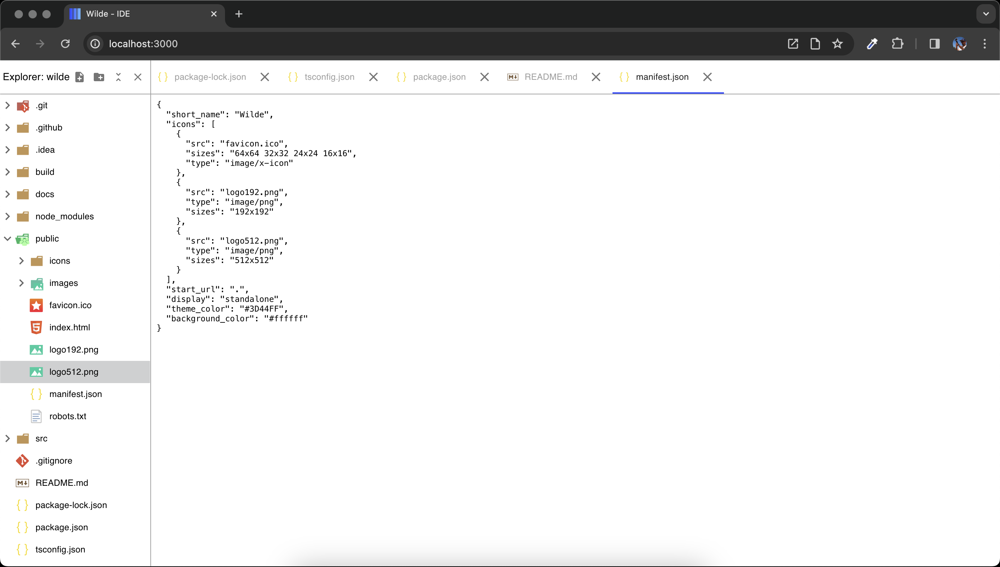

# Wilde

__!!!WORK IN PROGRESS PROJECT!!!__


Wilde is a web integrated local desktop environment. \
An IDE designed primarily to work on the web. It wasn't conceived as an Electron-like desktop application and later distributed on the web, but rather, it was born and growed-up within a browser tab.

Last version of Wilde is deployed [here](https://mpstyle.github.io/wilde/);



## About logo

**Font**: antre \
**Colors**: from left to right, #3D44FF and #6CB5FF.

## Libraries

Wilde uses:
- [React](https://react.dev/): for UI
- [Redux Toolkit](https://redux-toolkit.js.org/): for app state
- [MUI](https://mui.com/): for UI component
- [vscode-icons](https://github.com/vscode-icons/vscode-icons): for icons files

## Environment variables

- REACT_APP_VERSION: defined in `.env`, contains the `name` property value of `package.json`
- REACT_APP_NAME: defined in `.env`, contains the `version` property value of `package.json`
- PUBLIC_URL: defined in `.env.production`, contains the URL where the application where deployed

### How to use in code

```typescript
console.log(`${process.env.REACT_APP_NAME} ${process.env.REACT_APP_VERSION}`)
```

## Techniques:
- [Lazy loading](https://en.wikipedia.org/wiki/Lazy_loading): used to load into the app state only the folders opened by the user.
- [Windowing](https://www.patterns.dev/vanilla/virtual-lists/): used to render only the visible tree items in the DOM

## TODO list (not in priority order):
- Color highlight on monaco editor
- Add capability to resize sidebar
- ~~Add capability to open a file~~
- Add keyboard shortcut to open a folder
- Add keyboard shortcut to open a file
- Add confimation dialog when try to close an modified editor
- Add hamburger menu to use as window menu
- Add git color highlight on filenames
- Add search in project
- Add search in file
- Add replace in project
- Add replace in file
- Load custom shortcut from local storage or IndexDB
- ~~Add check to verify compatibility of browser~~
- Load theme using system preference
- Load custom theme from local storage or IndexDB
- Add welcome editor
- ~~Show the name of the current editor in the page title~~
- Add dark theme
- ~~Add LICENSE file~~